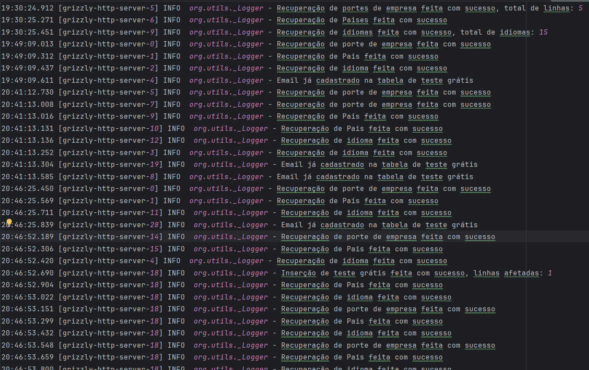
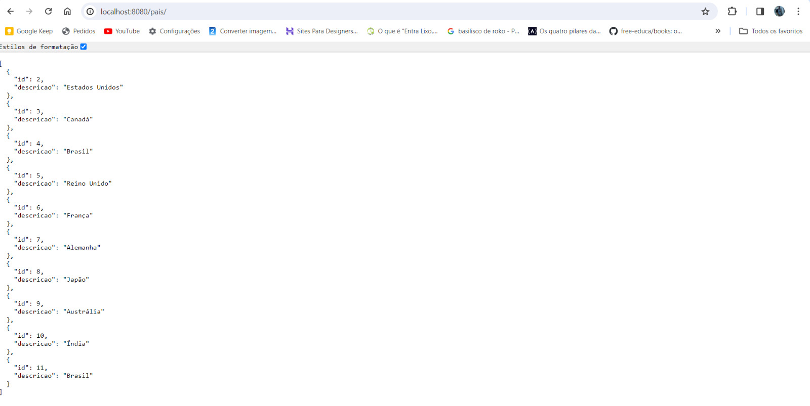
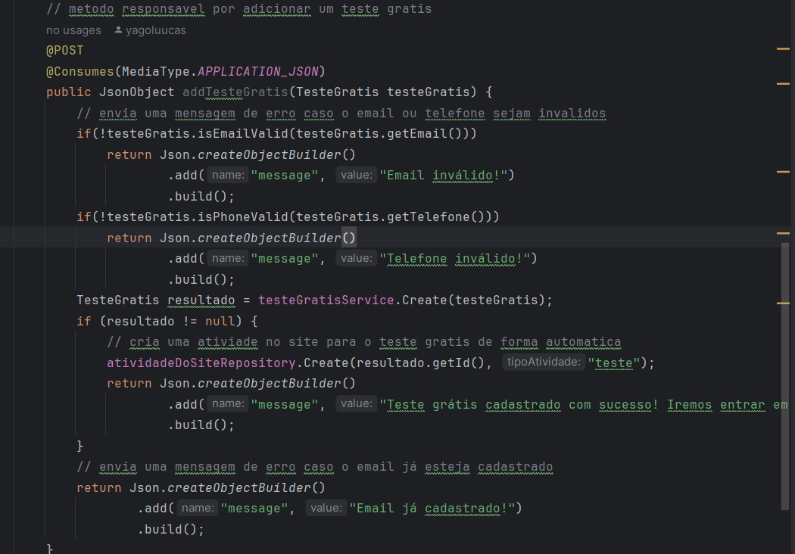
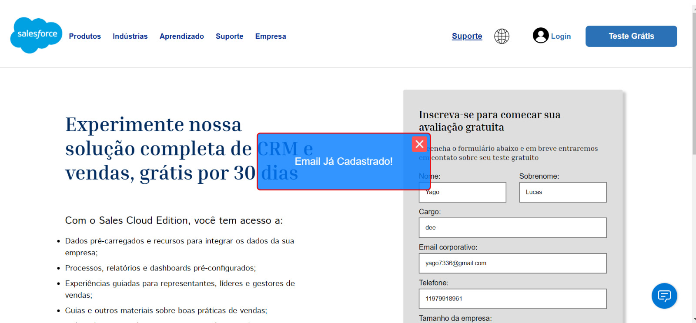
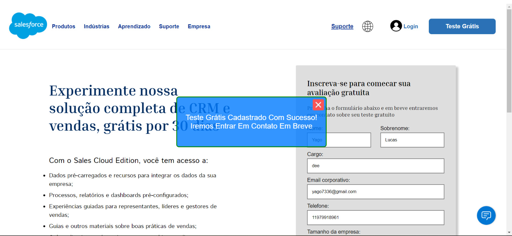

# Projeto Salesforce

# Sumário
- [Objetivo](#objetivo)
- [Requisitos](#requisitos)
- [Instalação](#instalação)
- [Descrição sobre o projeto](#descrição-sobre-o-projeto)
- [Classe main](#clase-main)
- [Configuração do banco de dados](#configuração-do-banco-de-dados)
- [Configuração do CORS](#configuração-do-cors)
- [Interface de LOGGER](#interface-de-logger)
- [Projeto em execução](#projeto-em-execução)
- [Insert no banco de dados](#insert-no-banco-de-dados)
- [Imagens da aplicação](#imagens-da-aplicação)
- [Conclusão](#conclusão)

## Objetivo
Nosso projeto tem como objetivo criar um sistema de integração com o banco de dados e com a nossa página do challenge Salesforce

## Requisitos
Para rodar esse projeto é necessário ter instalado:
- Java 21
- Maven

## Instalação
Para instalar o projeto, basta clonar o repositorio e rodar o comando:
```git
 git clone https://github.com/yagoluucas/projeto_salesforce_java.git
```
## Descrição sobre o projeto
O projeto foi desnvolvido utilizando o Java e o Grizzly, um servidor HTTP em Java. O projeto é um sistema de integração com o banco de dados e com a nossa página do challenge salesforce. 
O projeto foi desenvolvido para a atender a nossa 3 sprint do challenge da salesforce, e nele temos os seguintes pacotes:
- Configuration : onde temos a configuração do banco de dados e tambem a configuração do header de acesso ao CORS
- Entities: onde temos as entidades do banco de dados
- Example: onde temos os nossos metodos POST e GET para a integração do banco de dados com a nossa página
- Repository: onde temos nosso crud do banco de dados
- Services: aonde é aplicado a regra de negocio
- Utils: aonde temos a nossa classe de _LOGGER

## Clase Main

Na classe Main, temos o metodo main, que é o metodo principal do projeto, onde é iniciado o servidor HTTP na qual é
criado na url:
'http://localhost:8080/'

## Configuração do banco de dados
Para configurar o banco de dados, foi necessário criar um arquivo de configuração chamado OracleDatabase, lá está disponível
as configurações do banco de dados, como o nome do banco, o usuário e a senha.

Além disso, lá tem um metodo que ao ser chamado, cria uma conexão com o banco de dados e retorna essa conexão, metodo que foi amplamento usado no projeto e nos repositories.

## Configuração do CORS
Para configurar o CORS, foi necessário criar um arquivo de configuração chamado CorsFilter, lá está disponível um metodo que configura o header de acesso ao CORS, permitindo que a nossa página acesse o nosso sistema.

## Interface de LOGGER
Para a interface de LOGGER, foi necessário criar um arquivo de configuração chamado Logger, lá está disponível um metodo que configura o LOGGER, permitindo que o sistema faça logs de informações, erros e etc.

Essas linhas de LOGGER fica armazenada em um arquivo chamado salesforce.log dentro da pasta logs.

## Projeto em execução
Abaixo temos print que mostra o projeto em execução.

### Registro de _LOGGER
Abaixo temos nosso registro de _LOGGER, onde é mostrado o log de informações, erros e etc.


### GET
Usamos o GET para pegar os dados do banco de dados e mostrar na nossa página, neste exemplo usamos o 


### POST
Usamos o POST para pegar um um teste grátis do nosso site e salvar no banco de dados usando o metodo abaixo:


Caso de algum erro, enviamos uma mensagem ao front end, como por exemplo, quando já tem um teste grátis cadastrado com o mesmo email:


Caso não de erro, enviamos uma mensagem ao front end, como por exemplo, quando o teste grátis é cadastrado com sucesso:


## Insert no banco de dados
No nosso projeto, na classe main, deixamos 2 inserções em duas tabelas diferentes, para quando o codigo ser executao 
essa inserção seja feita no banco de dados, caso queira confirmar voce pode tem 3 opçoes:
- Acessar o banco de dados e executar uma QUERY nas tabelas de idioma e pais, usando a query abaixo
```sql
SELECT * FROM IDIOMA;
SELECT * FROM PAIS;
```
- É possivel acessar nosso arquivo de log disponivel na pasta logs, e verificar se a inserção foi feita com sucesso
- Ir até o seu navegador e inserir o link abaixo para o mesmo fazer uma consultar no banco de dados usando o metodo GET:
http://localhost:8080/idioma/  
http://localhost:8080/pais/  
Caso não funcione, verifique se o arquivo Java foi executado com sucesso.

## Imagens da aplicação
Em nossa pasta imagens voce pode verificar com melhor qualidade as imagens da nossa aplicação incluindo print das telas do front end e o diagrama uml

## Conclusão
O projeto foi desenvolvido com sucesso, atendendo a nossa 3 sprint do challenge da salesforce, onde foi desenvolvido um sistema de integração com o banco de dados e com a nossa página do challenge Salesforce.


